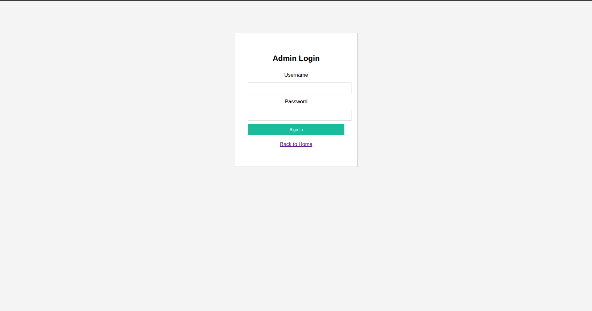
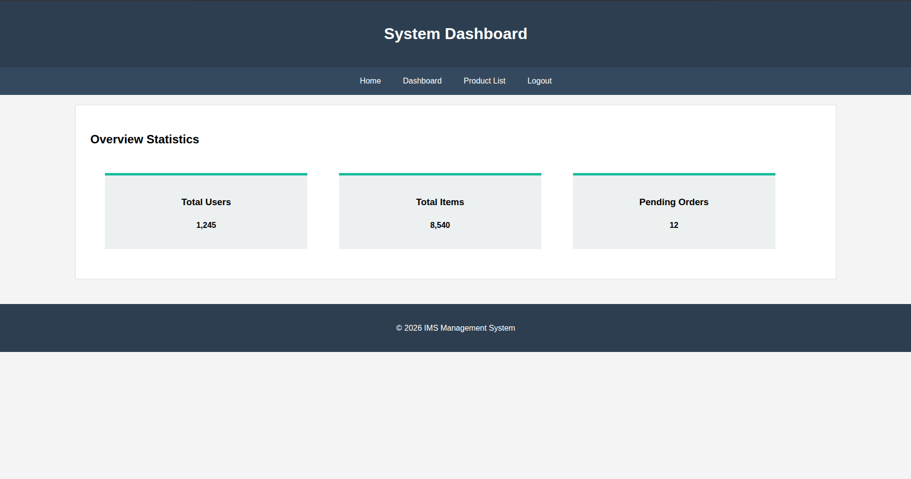
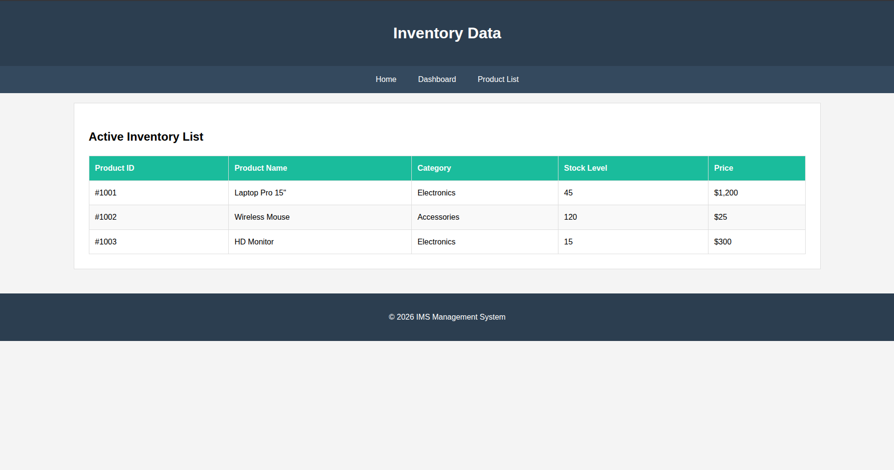

# LAB ASSIGNMENT 3  
## HTML & CSS Fundamentals – Static Web Page Design

### Assignment Title
Designing a Static Inventory Management System Web Interface

### Description
This project is a static web interface created using HTML5 and CSS3.
It represents a Inventory Management System with multiple linked pages.
No backend or JavaScript functionality is used.

### Pages Included
- Home Page
- Login Page
- Dashboard Page
- Inventory Listing Page

### Technologies Used
- HTML5
- CSS3 (Basic styling only)

### Folder Structure
- Separate HTML files for each page
- External CSS file
- Images folder for assets

### Screenshots
📷 Home Page
  
📷 Login Page  

📷 Dashboard Page  

📷 Product List Page  

