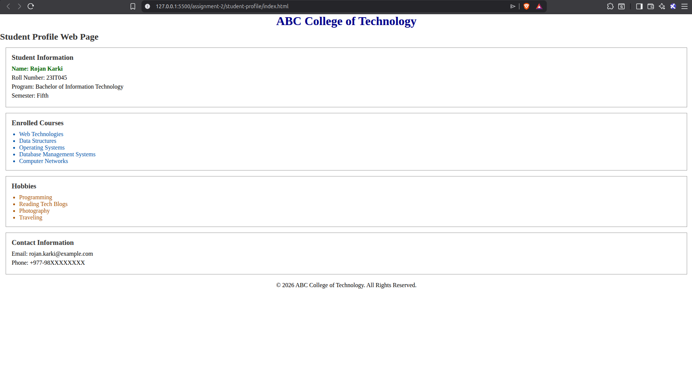
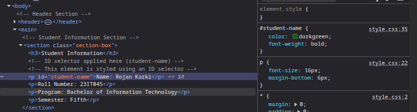
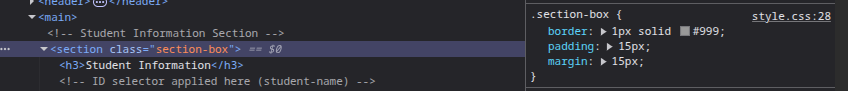

# Web Technologies and Platforms  
## Lab Assignment – 02  
### HTML and CSS Fundamentals Using Selectors

---

## 📌 Student Profile Web Page

This repository contains the solution for **Lab Assignment – 02**, which focuses on creating a structured web page using **HTML5 semantic elements** and applying styles using **basic CSS selectors** only.

The project demonstrates correct usage of:
- Semantic HTML structure
- External CSS styling
- CSS selectors up to element, class, ID, group, descendant, and universal selectors

Advanced CSS techniques and scripting languages are strictly avoided as per lab instructions.

---

## 🎯 Learning Objectives

By completing this lab assignment, the following objectives are achieved:

- Creating a well-structured HTML document
- Using semantic HTML elements correctly
- Applying CSS using different types of selectors
- Maintaining separation between content and presentation
- Inspecting and analyzing applied CSS using browser developer tools

---

## 🛠 Tools & Technologies Used

- **HTML5**
- **CSS3 (Selectors only)**
- **Visual Studio Code**
- **Google Chrome / Mozilla Firefox**

---

## 📁 Project Folder Structure

student-profile/
│── index.html
│── style.css
│── README.md

---

## 🧩 Implementation Details

### HTML Structure
The webpage includes the following sections:
- Header (College name and page title)
- Student Information
- Course Information
- Hobbies
- Contact Information
- Footer

Semantic HTML elements such as `<header>`, `<main>`, `<section>`, and `<footer>` are used throughout the document.

---

### CSS Styling
All styling is done using an **external CSS file** (`style.css`) and includes:

- **Universal Selector** – Reset default margin and padding
- **Element Selectors** – Styling headings and paragraph text
- **Class Selector** – Reusable `section-box` class for layout consistency
- **ID Selector** – Unique styling for student name
- **Group Selector** – Common styles for level-two and level-three headings
- **Descendant Selector** – Different styles for course and hobby list items

---

## 🔍 Inspection and Analysis

Using the browser’s developer tools:
- An element styled using a **class selector** was identified and documented
- An element styled using an **ID selector** was identified and documented

These are clearly mentioned as **HTML comments** inside the `index.html` file.

---

## ⚠️ Constraints Followed

✔ No inline CSS  
✔ No internal `<style>` tags  
✔ No JavaScript  
✔ No Flexbox, Grid, Media Queries, or animations  

---

## 📸 Screenshots

Screenshots of the completed webpage and inspection task are included below:

### Full Webpage View

### ID Selector Inspection

### Class Selector Inspection

---

## ✅ Evaluation Criteria Coverage

- HTML Structure and Semantics ✔  
- CSS Selector Usage ✔  
- Inspection Task Completion ✔  
- Code Organization and Readability ✔  

---

## 📜 Academic Integrity

This project is an **original work** created solely for academic purposes.  
No external templates or copied code have been used.

---

## 🏁 Conclusion

This lab assignment strengthened the understanding of HTML structure and CSS selector usage, forming a solid foundation for advanced web styling techniques in future labs.

---

**Submitted by:** Om Dev Karki  
**Course:** Web Technologies and Platforms  
**Lab Assignment:** 02  
